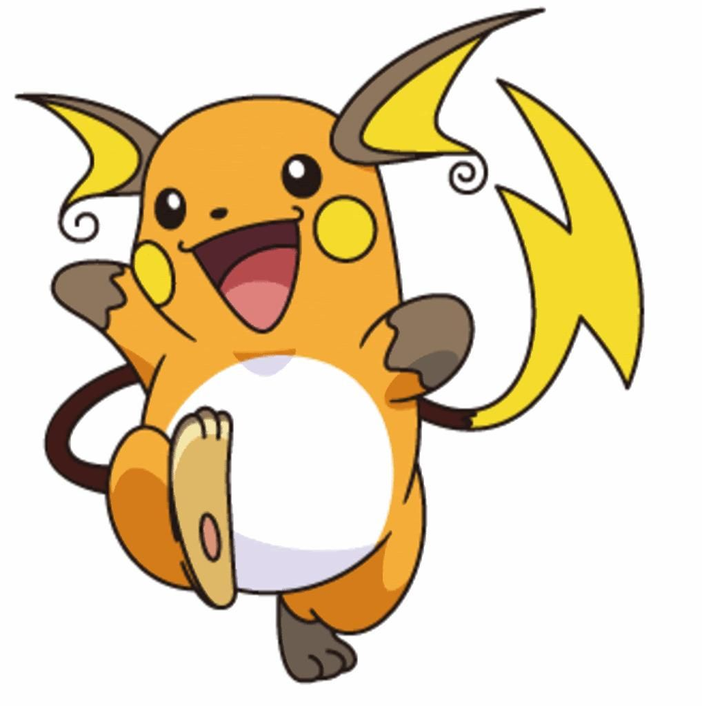

# 🧠 Pokemon Image Classifier: Pikachu vs Raichu

This project uses a Convolutional Neural Network (CNN) to classify Pokemon images as either Pikachu or Raichu. This model showcases how deep learning can be applied to cartoon character recognition.

---

## 📂 Project Structure
- `Pokemon Prediction Project.ipynb` — Main training and evaluation notebook
- `data/` — Directory for training/testing images
- `models/` — Directory for saved models
- `images/` — Visual results and samples
- `requirements.txt` — Python packages used

---

## 🛠️ Tech Stack
- Python 
- TensorFlow/Keras
- NumPy
- OpenCV
- Matplotlib

---

## 🚀 Steps
1. Preprocess the image dataset (resize, normalize)
2. Build and compile the CNN model
3. Train with training data
4. Evaluate on test data
5. Predict whether the image is Pikachu or Raichu

---

## 📷 Sample Prediction

---

## 🧠 Conclusion
The model successfully classifies between Pikachu and Raichu with good accuracy. This project demonstrates the potential of CNNs in custom character recognition problems.

## 📩 Connect to me

Email: [santoshkumar729629@gmail.com]  
LinkedIn: [www.linkedin.com/in/santosh-kumar-sk]

 
